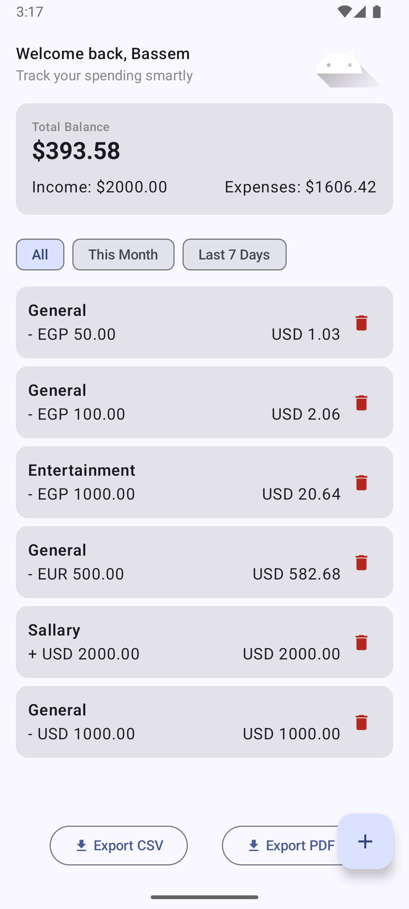
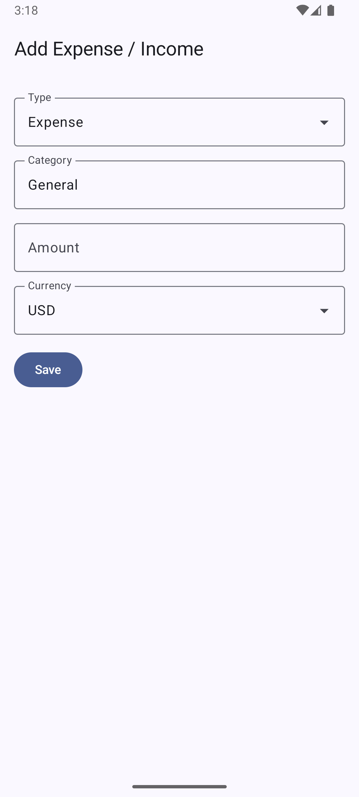

# Expense Tracker Lite

A native Android expense tracking app built with Jetpack Compose, featuring currency conversion, pagination, offline support, and advanced features like export and animations.

## 🎯 Features

- **Dashboard Screen**: Welcome message, profile image, total balance, income/expenses display
- **Add Expense Screen**: Category selection, amount input, currency conversion, date picker, income/expense type selection
- **Pagination**: 10 items per page with infinite scroll/load more functionality
- **Currency Conversion**: Real-time conversion using open.er-api.com with autocomplete dropdown
- **Offline Support**: Local storage with Room database
- **Filtering**: This Month, Last 7 Days, All time filters with visual highlighting
- **Delete Functionality**: Delete expenses with confirmation via delete button
- **Export Features**: Export expenses to CSV and PDF formats with share functionality
- **Animations**: Smooth transitions, loading animations, and list item animations
- **Modern UI**: Material Design 3 with Jetpack Compose and enhanced styling

## 🏗️ Architecture

### Clean Architecture with MVVM

```
ui/ → Composables & Screens
├── screens/
│   ├── DashboardScreen.kt
│   └── AddExpenseScreen.kt
├── navigation/
│   └── NavGraph.kt
├── theme/
└── utils/
    └── FileUtils.kt

viewmodel/ → State, Events, ViewModel
├── DashboardViewModel.kt
└── AddExpenseViewModel.kt

domain/ → UseCases, Entities
├── model/
│   └── Expense.kt
├── repository/
│   └── ExpenseRepository.kt
├── usecase/
│   └── ConvertToUsdUseCase.kt
└── mappers/
    └── ExpenseMappers.kt

data/ → Repository, DataSource, DTO, Mappers
├── local/
│   ├── ExpenseEntity.kt
│   ├── ExpenseDao.kt
│   └── AppDatabase.kt
├── remote/
│   └── ExchangeRateApi.kt
├── repository/
│   └── ExpenseRepositoryImpl.kt
├── service/
│   └── ExportService.kt
└── di/
    └── AppModule.kt
```

### Key Technologies

- **UI**: Jetpack Compose, Material Design 3
- **Architecture**: MVVM with Clean Architecture
- **Dependency Injection**: Hilt
- **Database**: Room with Kotlin Coroutines
- **Networking**: Retrofit, OkHttp, Moshi
- **State Management**: StateFlow
- **Navigation**: Navigation Compose with animations
- **Export**: Apache Commons CSV, iText7 PDF
- **File Sharing**: Android FileProvider
- **Testing**: JUnit, Coroutines Test, Turbine

## 🎨 UI/UX Features

### Animations
- **Screen Transitions**: Smooth slide animations between Dashboard and Add Expense screens
- **Loading Animations**: Custom animated loading indicator with pulsing effect
- **List Animations**: Slide-in and fade-in animations for expense list items
- **Interactive Feedback**: Visual feedback for user interactions

### Enhanced Styling
- **Summary Card**: Distinct background styling to differentiate from list items
- **Filter Highlighting**: Visual indication of selected filter with Material Design chips
- **Delete Buttons**: Red delete icons with proper touch targets
- **Export Buttons**: Loading states with progress indicators

### Export Functionality
- **CSV Export**: Complete expense data export with proper formatting
- **PDF Export**: Professional PDF reports with styling
- **File Sharing**: Native Android share sheet integration
- **Progress Feedback**: Loading indicators during export process

## 🧪 Unit Tests

### Test Structure

The project includes comprehensive unit tests following the **Arrange-Act-Assert** pattern:

```
app/src/test/java/com/bn/bassemexpensetrackerlite/
├── AddExpenseViewModelTest.kt
├── ConvertToUsdUseCaseTest.kt
├── DashboardViewModelTest.kt
└── ExpenseRepositoryTest.kt
```

### Test Coverage

#### 1. AddExpenseViewModelTest
- **`invalid amount shows error`**: Tests validation logic for negative/zero amounts
- **`save converts EUR to USD and persists`**: Tests currency conversion and persistence
- **`currency selection updates available currencies`**: Tests currency dropdown functionality
- **`income type selection works correctly`**: Tests expense/income type switching

#### 2. ConvertToUsdUseCaseTest
- **`converts using rates map`**: Tests EUR to USD conversion (10 EUR → 20 USD)
- **`returns original amount when currency is USD`**: Tests USD currency handling

#### 3. DashboardViewModelTest
- **`loads first page and totals`**: Tests initial data loading and totals calculation
- **`can load more when data available`**: Tests pagination functionality
- **`delete expense removes item and refreshes data`**: Tests delete functionality
- **`export to CSV generates correct format`**: Tests CSV export functionality
- **`export to PDF generates correct format`**: Tests PDF export functionality

#### 4. ExpenseRepositoryTest
- **`insert expense returns valid id`**: Tests expense insertion
- **`delete expense removes from database`**: Tests expense deletion
- **`get expenses paged returns correct data`**: Tests pagination
- **`fetch rates returns valid data`**: Tests API integration

### Running Tests

#### Option 1: Android Studio
1. Right-click on `app/src/test/java/com/bn/bassemexpensetrackerlite/`
2. Select "Run Tests in 'com.bn.bassemexpensetrackerlite'"

#### Option 2: Command Line
```bash
# Run all unit tests
./gradlew testDebugUnitTest

# Run specific test class
./gradlew testDebugUnitTest --tests "com.bn.bassemexpensetrackerlite.AddExpenseViewModelTest"

# Run specific test method
./gradlew testDebugUnitTest --tests "com.bn.bassemexpensetrackerlite.AddExpenseViewModelTest.invalid amount shows error"
```

#### Option 3: Using the provided script
```bash
chmod +x run_tests.sh
./run_tests.sh
```

### Test Dependencies

```kotlin
// Testing
testImplementation(libs.junit)
testImplementation(libs.mockito.core)
testImplementation(libs.mockwebserver)
testImplementation(libs.kotlinx.coroutines.test)
testImplementation(libs.turbine)
```

## 🚀 Getting Started

### Prerequisites
- Android Studio Hedgehog or later
- Android SDK 35
- Kotlin 2.0.21

### Installation

1. Clone the repository:
```bash
git clone <repository-url>
cd BassemExpenseTrackerLite
```

2. Open in Android Studio and sync project

3. Run the app on an emulator or device

### Build Configuration

- **compileSdk**: 35
- **targetSdk**: 35
- **minSdk**: 24
- **Kotlin**: 2.0.21

## 📱 Screenshots

### Dashboard Screen


- Welcome message with profile image
- Summary cards showing total balance, income, and expenses (with distinct styling)
- Filter chips (This Month, Last 7 Days, All) with visual highlighting
- Paginated expense list with load more functionality
- Delete buttons for each expense item
- Export buttons (CSV/PDF) with loading states
- Floating Action Button to add new expense
- Smooth animations and transitions

### Add Expense Screen


- Category selection with icons
- Amount input with currency symbol
- Currency dropdown with autocomplete (fetched from API)
- Income/Expense type selection dropdown
- Date picker
- Save button with validation
- Smooth screen transitions

## 🔧 API Integration

### Currency Conversion
- **API**: https://open.er-api.com/v6/latest/USD
- **Free tier**: No API key required
- **Rate limits**: 1000 requests per month
- **Fallback**: Mock data for offline scenarios
- **Dynamic Currency List**: Fetches all available currencies for dropdown

### Supported Currencies
- USD, EUR, GBP, AED, SAR, EGP, and more (fetched dynamically from API)

## 📊 Pagination Strategy

- **Page Size**: 10 items per page
- **Implementation**: Local pagination using Room database
- **Loading States**: Animated loading indicators and error handling
- **Filter Integration**: Pagination works with all filters (This Month, Last 7 Days, All)
- **Delete Integration**: List refreshes automatically after deletion

## 🗄️ Data Storage

### Room Database
- **Entity**: ExpenseEntity with all expense fields
- **DAO**: ExpenseDao with pagination, aggregation, and delete methods
- **Database**: AppDatabase with Room configuration

### DataStore (Planned)
- User preferences
- App settings
- Currency preferences

## 📤 Export Features

### CSV Export
- **Format**: Standard CSV with headers
- **Content**: All expense fields (Date, Category, Amount, Currency, USD Amount, Type)
- **Sharing**: Native Android share sheet
- **File Handling**: Temporary file creation and cleanup

### PDF Export
- **Format**: Professional PDF report
- **Content**: Formatted expense data with styling
- **Sharing**: Native Android share sheet
- **File Handling**: Temporary file creation and cleanup

### File Management
- **Permissions**: Handles storage permissions gracefully
- **FileProvider**: Secure file sharing implementation
- **Cleanup**: Automatic temporary file cleanup

## 🎨 Design Implementation

The app closely follows the provided Dribbble design with enhancements:
- **Typography**: Material Design 3 typography scale
- **Colors**: Material Design 3 color system
- **Shapes**: Rounded corners and elevation
- **Spacing**: Consistent 8dp grid system
- **Icons**: Material Design icons
- **Animations**: Smooth transitions and micro-interactions
- **Visual Hierarchy**: Distinct styling for different UI components

## 🐛 Known Issues

1. **Gradle Test Configuration**: Some Gradle test tasks may require Android Studio for optimal execution
2. **NDK Warnings**: NDK source.properties warnings (non-critical)
3. **Deprecated APIs**: Some Compose APIs show deprecation warnings (will be updated in future versions)

## 🔮 Future Enhancements

- [x] ~~Export expenses to CSV/PDF~~ ✅ **COMPLETED**
- [x] ~~Delete functionality for expenses~~ ✅ **COMPLETED**
- [x] ~~Animations and transitions~~ ✅ **COMPLETED**
- [x] ~~Enhanced UI styling~~ ✅ **COMPLETED**
- [ ] Receipt image upload and storage
- [ ] Budget tracking and alerts
- [ ] Category management
- [ ] Data backup and sync
- [ ] Dark theme support
- [ ] Widgets for quick expense entry
- [ ] Advanced filtering and search
- [ ] Expense analytics and charts

## 📄 License

This project is created for technical interview purposes.

## 👨‍💻 Author

Built with ❤️ using modern Android development practices.

